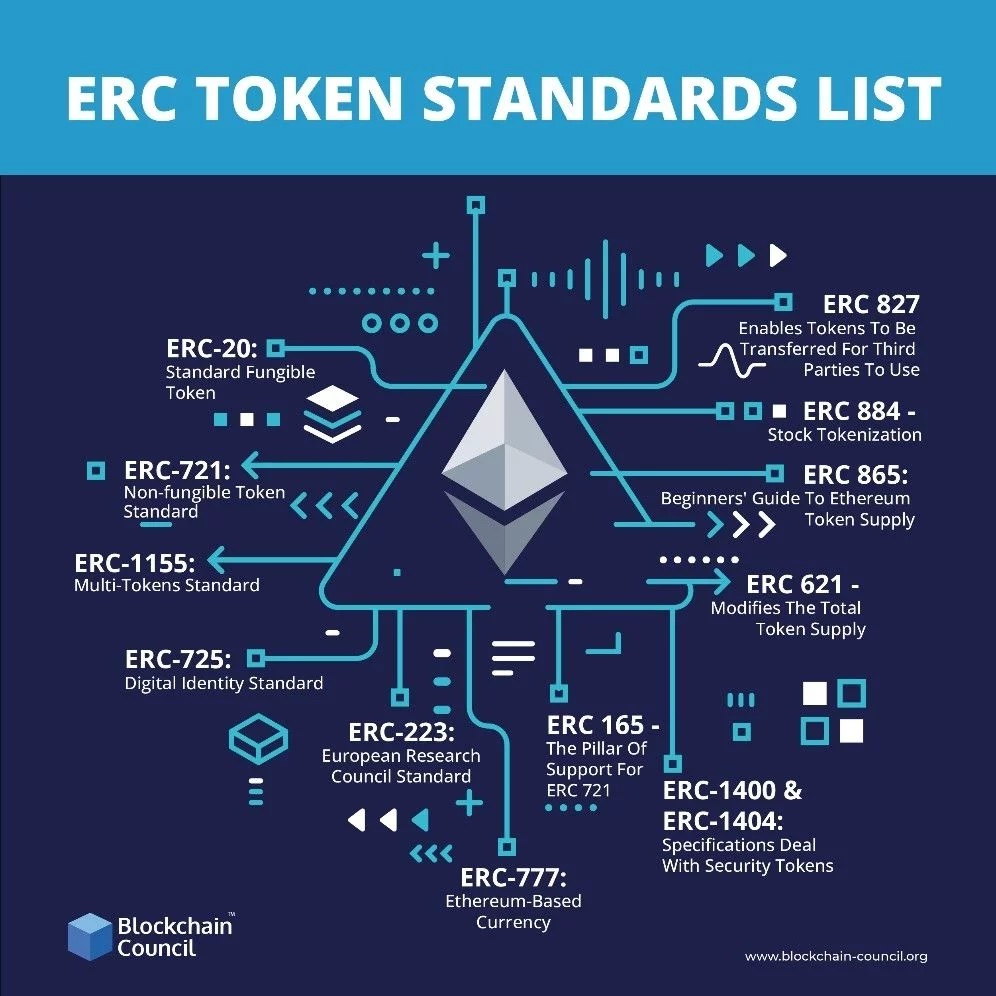

# Blockchain course


- [Crypto zombie solidity learn](https://cryptozombies.io/)
- [online solidity IDE](https://remix.ethereum.org/)
- [Open zeppelin tools](https://docs.openzeppelin.com/)

## Tools Installation 

- `npm i`
- `brew install --cask ganache`

> Optional
- setup `https://github.com/roynalnaruto/svm-rs`
- `svm install 0.8.16 && svm use 0.8.16`


## Try contract

- `npx truffle console`
```js
let instance = await MyPrivateLocation.deployed();
instance.setLocation(45777144, 4791939);
instance.getLocation(accounts[0]);
```

# Lesson 

## Protocole Bitcoin : 

[demo système de minage](https://andersbrownworth.com/blockchain/)

## Smart contract platform : ETH

- Les comptes sur la blockchain : https://ethereum.org/fr/developers/docs/accounts/ —> Deux types de comptes qui stockent deux choses différentes soit contrat (code déployé avec le quel on interagit) et compte externe (transaction uniquement + association clé privée et publique)
- Transactions -> pour tout type de compte elle peuvent consister à appeler un smart contract et de la logique “métier” ou simplement transférer de l’argent + cas du déploiement du smart contract, création d’un compte (https://ethereum.org/fr/developers/docs/transactions/)
- Stack technique de l’environnement d’execution des smart contracts : https://ethereum.org/fr/developers/docs/evm/


Transparence (encapsulation) et stockage = problématiques coeur dans la création des smart contracts. Impacte les coût en gas d’un smart contract.

Gas : Unité permettant de payer et exécuter les transaction. (https://ethereum.org/fr/developers/docs/gas/)

——————
Les spécification d’écriture des contrats

ERC-20 :  Tokens (Fungible token)

ERC-721 - NFT

ERC 1155 – The Most Advanced Non Fungible Token (multi token)
ERC 1155 solves all the major issues of ERC 20 and ERC 721 — the former best token standards for non fungible tokens. For ERC 1155, users can create multiple tokens in a single contract. Also, you can use ERC-1155 for the fungible and non-fungible use cases. All of these traits make ERC1155 better at storage management, efficient, and budget-friendly.




EIP-5114: Soulbound Badge :  immutable token holder / non transferable (identity, graduation…)

[**All implementation examples**](https://github.com/OpenZeppelin/openzeppelin-contracts/tree/master/contracts)
